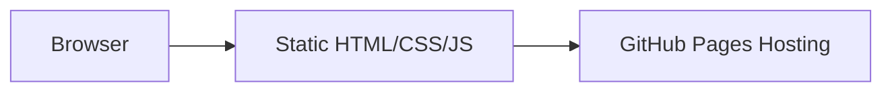

## 1. Architecture Design


## 2. Technology Description
- **Frontend**: Pure HTML5 + CSS3 + JavaScript (ES6+)
- **Styling**: CSS3 with Flexbox and Grid Layout
- **Icons**: Font Awesome CDN
- **Hosting**: GitHub Pages
- **Build Tool**: None (pure static site)

## 3. Route Definitions
| Route | Purpose |
|-------|---------|
| / | 首页，包含所有内容模块 |

## 4. Project Structure
```
z546948105.github.io/
├── index.html          # 主页面
├── css/
│   └── style.css       # 样式文件
├── js/
│   └── main.js         # 交互逻辑
├── images/
│   └── avatar.jpg      # 头像图片
└── README.md           # 项目说明
```

## 5. Component Breakdown

### 5.1 HTML Structure
- `<header>`: 固定导航栏
- `<section class="hero">`: Hero 区域
- `<section class="about">`: 个人简介
- `<section class="skills">`: 技术栈
- `<section class="projects">`: 项目展示
- `<section class="contact">`: 联系方式
- `<footer>`: 页脚

### 5.2 CSS Features
- CSS Variables 定义主题色
- Flexbox/Grid 布局
- CSS Animations 入场效果
- Responsive Media Queries
- Hover 状态样式

### 5.3 JavaScript Features
- 平滑滚动导航
- 打字机文字效果
- 元素可见性检测（触发动画）
- 移动端菜单切换

## 6. External Resources
- Font Awesome 图标库
- Google Fonts (可选)